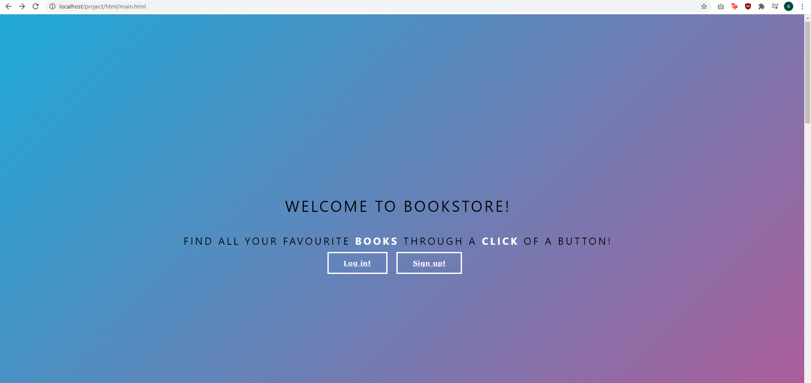
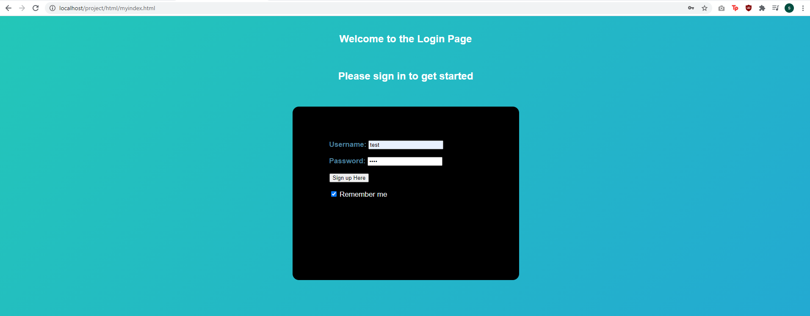
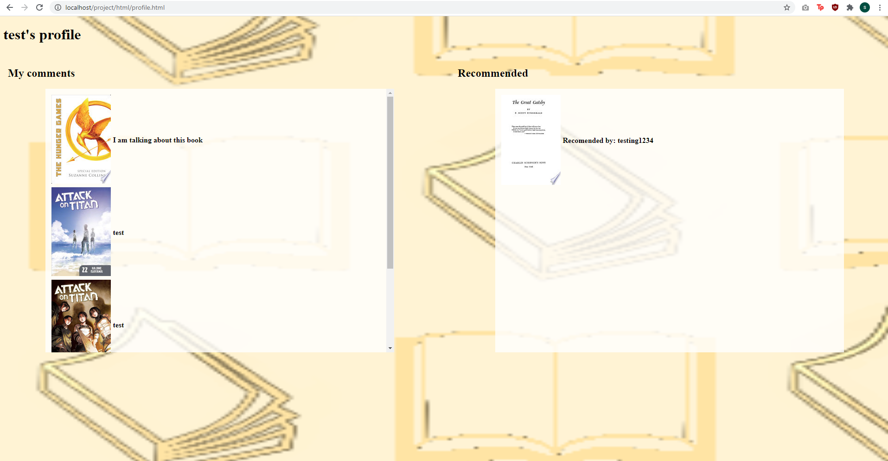
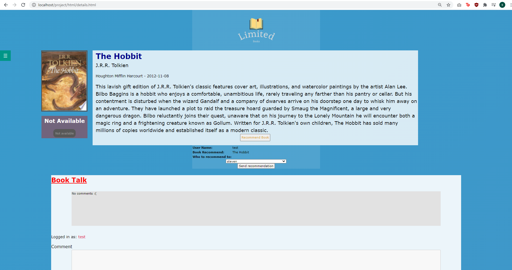

# Limited Books Project For CP476

Author: Quinn Brimley, Steven Tran, Pauline Gwozdz

Date: 2021-04-09

## Limited Books Website

### Index

{width=600px}

Upon starting the web application, the user is greeted with the main Page

The user has the option to move sign up / log in once the applicaion is launched

Upon scrolling the user can 

### Sign up

{width=600px}

Here users can Sign up to use our website, this will register the user into our db 

### Login

{width=600px}

 
Here users can Login using there user name and password (which the password is encrypted) and signs them in 

### Search

{width=600px}

Users can search for any book here and view details about them by clicking the "Details" button 

### Profile

{width=600px}

User profile shows all comments made by the user and all recommended books that others have recommended to them

### Details

{width=600px}

Here users can see details about the book, like a description and the publisher.

The user can also find where to buy the book by clicking the buy button 

Lastly the user can comment about the book, this shows all comments by other users and there own comments with timestamps of when the comment was posted

**References**

1. [Nav bar](https://www.w3schools.com/w3css/w3css_sidebar.asp)
2. [Logo created with](https://www.freelogodesign.org/manager/showcase/27e7d0b60aa4456fa2fff7365b106610)
3. [Search button](https://www.w3schools.com/howto/howto_css_search_button.asp)
4. [Animation for search bar](https://www.w3schools.com/js/js_htmldom_animate.asp)
5. [Contact Form](https://www.w3schools.com/howto/howto_css_contact_form.asp)
