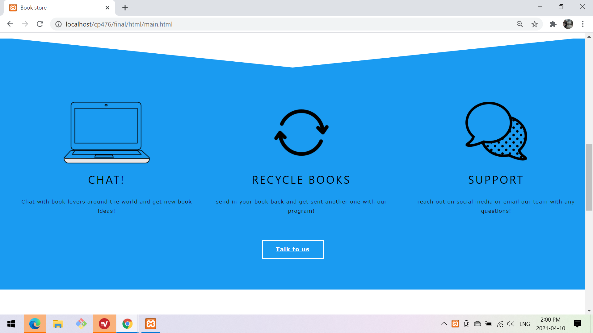
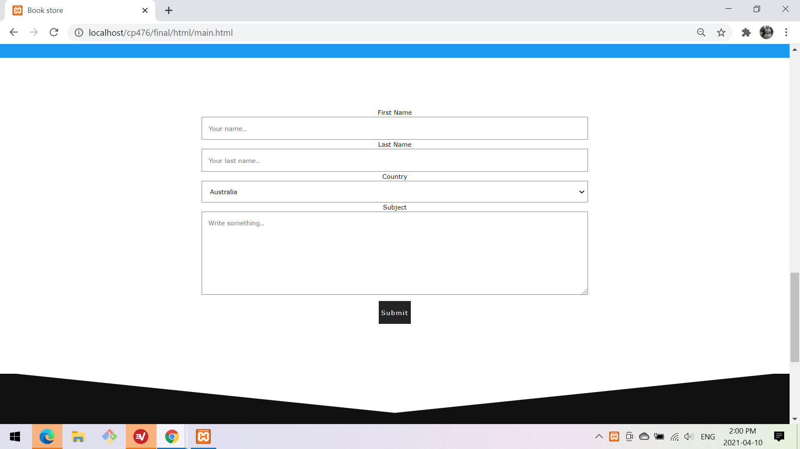
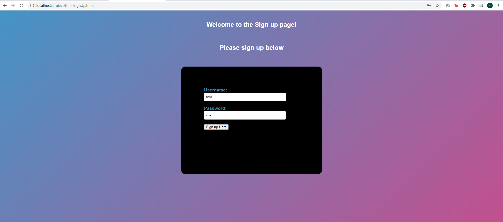
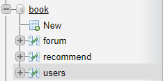
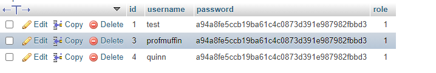
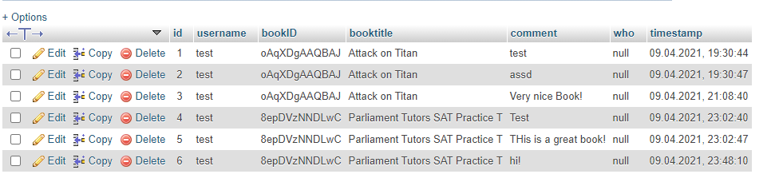
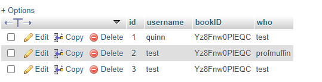

# Limited Books Project For CP476

Author: Quinn Brimley, Steven Tran, Pauline Gwozdz

Date: 2021-04-09

# Limited Books Website

## Pages

### Index

{width=600px}

{width=600px}

{width=600px}

{width=600px}

{width=600px}

    Our main Page allows users to get to know what our company is about, it sets up links to sign up or login if they
    already have an account
    and tells them what this website is about but how company came about. If they have any questions, we have a button
    "talk to us"
    to let them reach out to us with any concerns in the contact form below. We set up 5 sections for the main page so
    that it would be easier
    for users to get the information they needed instead of clicking a bunch of links to get them what they want.

    How we did the gradient background for our index section was by using CSS. Under the function background I used the
    property "linear-gradient"
    and choose the colours we wanted to use on the website. After the colours are choosen I used an animation property
    so that it switches between
    the colours infinite.

    How the contact form was created was by creating a form and then labeling every inout we needed from them such as
    name, email and etc.
    We also set up a select option for country, at the moment we only have 3 options for country but they can select any
    of the 3 when completing the form.

    The whole main page was mainly focussed on styling through our CSS file, and includes all the little things such as
    a hover over a button, the background,
    and the transition from which section which we used svg to create that cut slick look for a smooth transition. What
    we used in our main, we then took to
    use to help implement our other pages as well to keep a theme.

### Sign up

{width=600px}

Here users can Sign up to use our website, this will register the user into our db 

### Login

{width=600px}

 
Here users can Login using there user name and password (which the password is encrypted) and signs them in 

### Search

{width=600px}

{width=600px}

Users can search for any book here and view details about them by clicking the "Details" button 

### Profile

{width=600px}

User profile shows all comments made by the user and all recommended books that others have recommended to them

### Details

{width=600px}

Here users can see details about the book, like a description and the publisher.

The user can also find where to buy the book by clicking the buy button 

Lastly the user can comment about the book, this shows all comments by other users and there own comments with timestamps of when the comment was posted

## Client side

### JS

We have a gradient that allows us to have a nice dynamic background that looks modern and slick.
AJAX was used for the search, dyamically load the search results.
Use also used xhttps request to dynamically load certain things on the page, and send querys to our php files.
We used the google books API to allow us to find and load books.

## Server Side

### Login And Sign Up Scripts

On the server side we deal with the users sign up and login, were we take the user name and password from the user (passwords are encrpyed)
and either check to see if the user is actually saying who they are or sign them up by storing there details. User also cant use the same username as someone else

### Details script

Here the server will get the bookID and load all the details about it. It gives the book Title, the cover photo, the author, the publisher, and a
decription of the book. We also have a button that if the book is aviable to be purchesed online, it will take them straight there.

We have the recommend section. Here users can recommend books to other users, there is a drop down that has all users in the db and will allow the user
to pick who they want to recommend a book too. After clicking 'send recommendation' it will store the bookID with the user who recommended it to you.
These can later be viewed in the profile.

We have the 'book talk' section that allows people to talk about the books. Here the user can leave a comment which will be time stamped and displayed real time
With other users as well.

### User profile

Here the user can view there entire comment history as well as view all books that have been recommended to them.
If the user wants to check out the book thats been recommended they can click the details button which will take them to the details page.
This all gets pulled from the db.

## Database

Database has three tables, users, forum, recommend.

{width=600px}

### User Table

The user table stores users names and users passwords that are enycrpted and saved on the db.
It also contain roles ID for if they are a site admin or a normal user

{width=600px}

### Forum Table

This table has the username as a forgin key in it. Here we store all the users comments in the 'Book talk' section.
When a user makes a comment it stores who made the comment, with the bookID and book title and a time stamp.
We can use this time stamp to see when comments are made.

{width=600px}

### Recommend Table

The recommended table keeps track of recommend books. Users can recommend books to one another so this table keeps track
of the recommend books

{width=600px}

**References**

1. [Nav bar](https://www.w3schools.com/w3css/w3css_sidebar.asp)
2. [Logo created with](https://www.freelogodesign.org/manager/showcase/27e7d0b60aa4456fa2fff7365b106610)
3. [Search button](https://www.w3schools.com/howto/howto_css_search_button.asp)
4. [Animation for search bar](https://www.w3schools.com/js/js_htmldom_animate.asp)
5. [Contact Form](https://www.w3schools.com/howto/howto_css_contact_form.asp)
